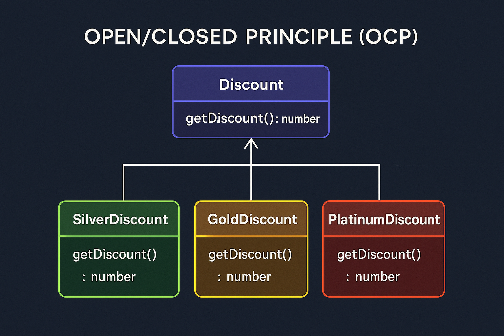
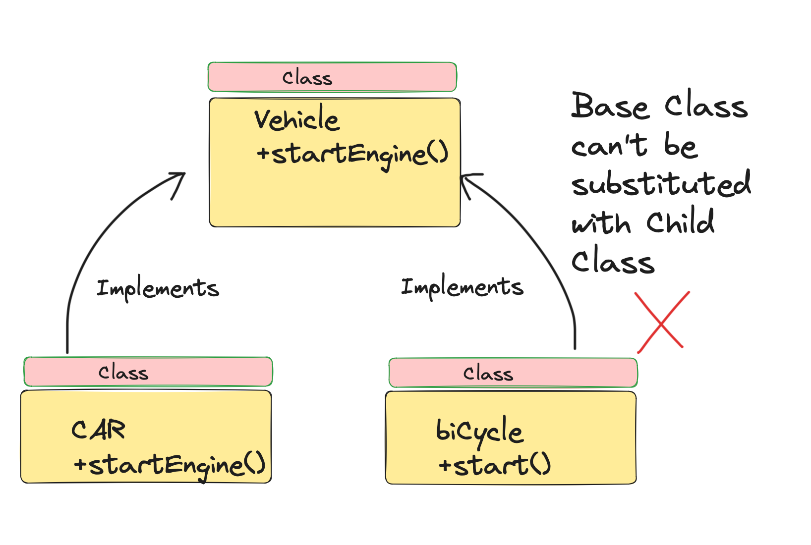
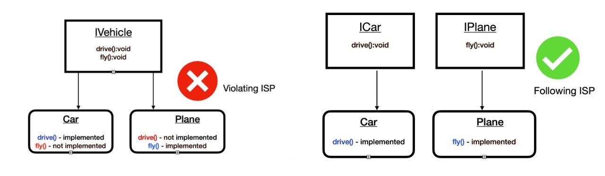
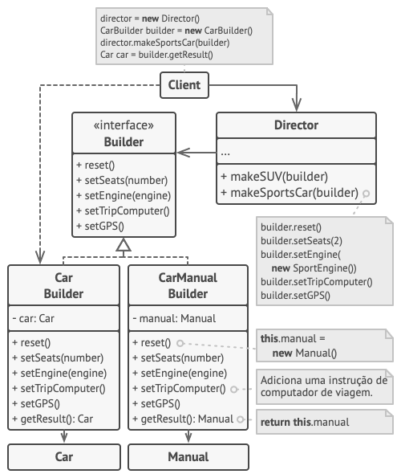

# Refatoração

A refatoração é o processo de reestruturação do código para melhorar sua legibilidade e reduzir sua complexidade, mantendo sua funcionalidade atual. Isso ajuda a melhorar a qualidade do software e facilitar a manutenção.

## Maus cheiros no código

- Código duplicado
- Funções longas
- Lista longa de parâmetros
- Dados globais e mutáveis (utilizar gets e sets)
- Classes com muitas atribuições
- Comentários demais (ao invés de explicar, extrair em uma função)

## SOLID

Conjunto de princípios para códigos orientados a objetos, com o objetivo de manter um padrão de qualidade.

### Single Responsability Principle

"Uma classe deve ter um, e apenas um, motivo para mudar."

Cada responsabilidade deve ser uma classe. Cada responsabilidade é um eixo de mudança. 

### Open-closed Principle

"Um método deve estar aberto para extensão, mas fechado para modificação."

Ao invés de uma classe com muitos ifs, subclasses pra cada contexto.

### Liskov Substitution Principle

"As subclasses devem ser substituíveis por suas classes base."

No exemplo abaixo, se Bicicleta herdar de Veículo, violaremos esse princípio. Uma solução é criar outras classes para Veículos com motor e sem motor.

### Interface Segregation Principle

"Muitas interfaces específicas do cliente são melhores do que uma interface de uso geral."

### Dependency Inversion Principle

"O DIP é a estratégia de depender de interfaces ou funções e classes abstratas, em vez de funções e classes concretas."

### Clean Code com Solid

Código que parece ser escrito por alguém que se importa com os demais desenvolvedores.

## Padrões de Design

Um padrão de projeto é uma solução geral, repetível, para um problema comum no projeto de software. É uma descrição ou modelo de como resolver um problema que pode ser usado em muita situações diferentes.

**Padrões Criacionais:**

### Factory Method

O **Factory Method** é um padrão de projeto criacional que fornece uma interface para criar objetos em uma superclasse, mas permite que as subclasses alterem o tipo de objetos que serão criados.

Separa-se em *Fábrica* e *Produto*, onde a Fábrica se subdivide em classes concretas e recebe uma interface de um Produto, que se subdivide em Produtos concretos.

É utilizado quando não sabemos quantos Produtos teremos utilizando a Fábrica, então criamos um design fácil de expandir pra novos Produtos.

Exemplo: [factory.py](./padroes-de-projetos/factory.py)

Refactoring Guru: [Factory Method](https://refactoring.guru/pt-br/design-patterns/factory-method)

### Abstract Factory

Permite produzir famílias de objetos relacionados sem especificar suas classes concretas.

Se precisamos criar uma lista de itens (buttons, checkboxs...) e cada item ter tipos diferentes (pra windows, pra mac...), usamos uma classe abstrata pra Factory (no exemplo abaixo, o GUIInterface) que implementa a criação das classes abstratas dos itens (Checkbox e Button). Como resultado, você não precisa modificar o código do cliente cada vez que adicionar uma variação de elementos de UI em sua aplicação. Você só precisa criar uma nova classe fábrica que produza esses elementos e modificar de forma sutil o código de inicialização da aplicação de forma que ele selecione aquela classe quando apropriado.

Refactoring Guru: [Abstract Factory](https://refactoring.guru/pt-br/design-patterns/abstract-factory)

### Builder

O padrão Builder é utilizado quando precisamos criar um objeto complexo, que pode ter muitos parâmetros de criação (a casa tem piscina, quantos andares, quantos quartos..). 

Ao invés de inicializar a classe com todos os parâmetros, criamos uma classe inicializadora abstrata, que tem todos os métodos e atributos que passamos pra classe.

Ainda podemos criar um *Director* que cuida de montar cada builder de forma específica. 

Refactoring Guru: [Builder](https://refactoring.guru/pt-br/design-patterns/builder)