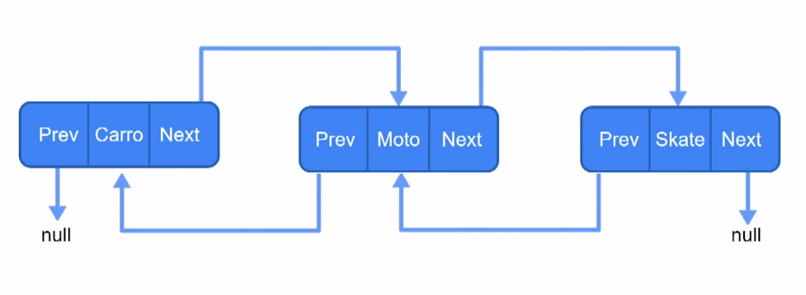

# Collections

## Iterator e Comparator

A interface Iterator faz parte do framework collections. É útil para acessar elementos dentro de uma coleção.

Possui uma subinterface ListIterator.

Oferece 4 métods que podes ser usado para várias operações nos elementos das coleções:

- hasNext()
- next()
- remove()
- forEachRemaining()

## LinkedList

Listas encadeadas, onde cada elemento aponta pro valor do próximo e do anterior.

## HashSet

É uma classe do framework Collections do Java que fornece as funcionalidades da estrutura de dados da tabela de hash.

## TreeSet

Estrutura de dados em árvore.