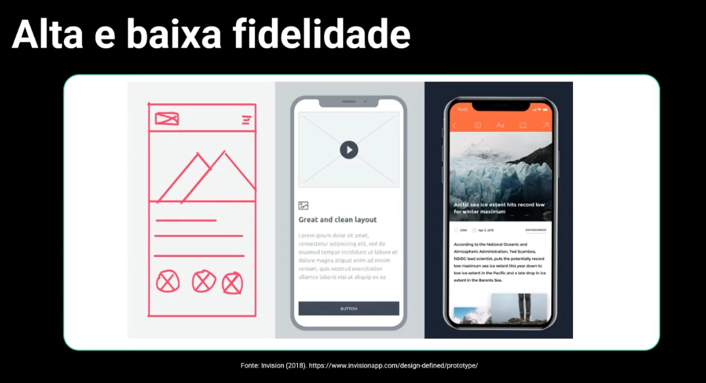

# Fase de Prototipação

## Alta e baixa fidelidade

A prototipação é uma atividade cíclica para responder a perguntas que ajudam a chegar na solução final.
Nas fase iniciais de um projeto devemos criar protótipos que sejam rápidos e fáceis de testar.

Fidelidade relacionada ao layout.

## Ferramentas de prototipação

Podem ser clássicas como lápis e papel, quadro em branco, ou protótipos de alta fidelidade com o Figma e Adobe Xd.

## Handoff

É a entrega do arquivo pro desenvolvedor Front-End programar. É um protótipo de alta fidelidade com layout.

Envolve entrega com assets, como:

- Fontes
- Cores
- Ícones
- Imagens
- Estilos CSS
- Grid
- Espaçamentos e alinhamentos
- Textos
- Animações
- Entrega de telas responsivas