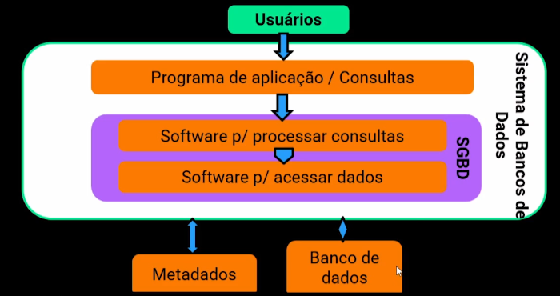
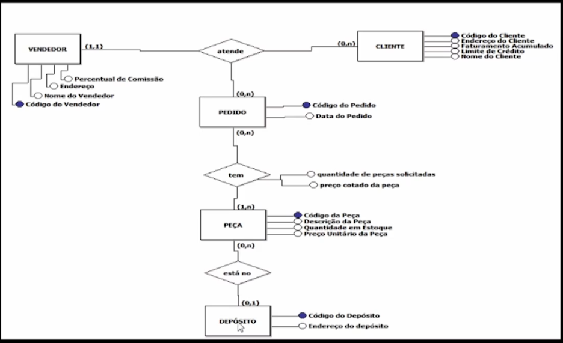
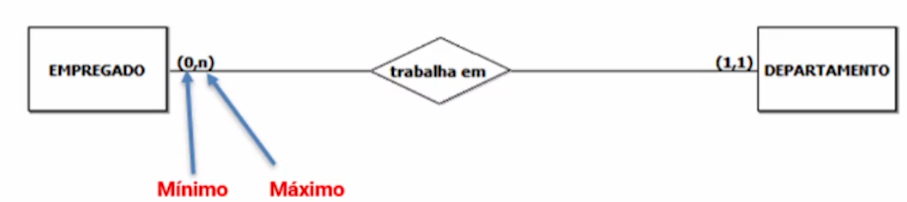
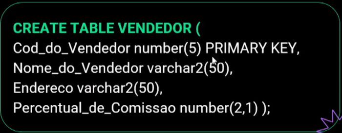
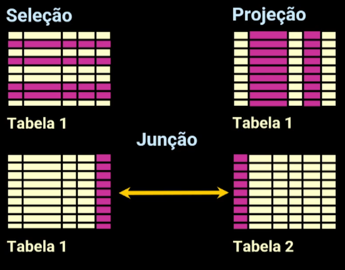
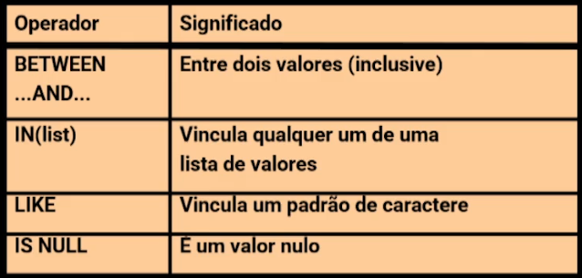
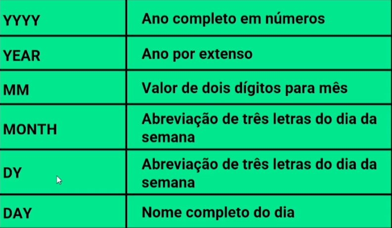
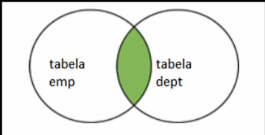
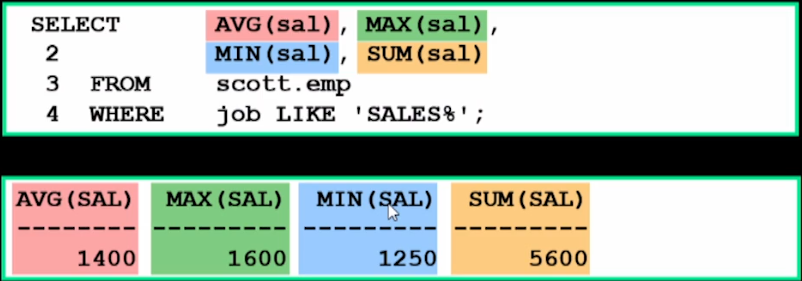
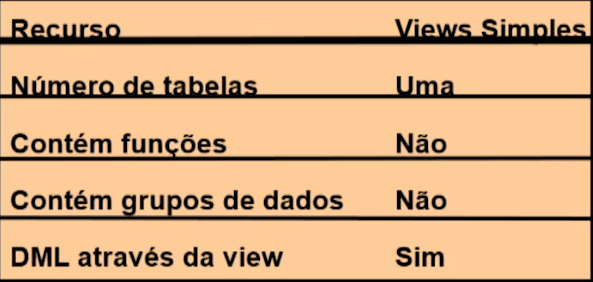

# Essencial Database

**Conceitos**

- Diferenciar dados, informação e conhecimento;
- Conhecer e entender a definicção de banco de dados, SGBDs e a principais características de banco de dados;
- Desenvolver a modelagem, Entidade Relacionamento no nível conveitual e realizar a engenharia de requisitos para definição de escopos;
- Implementar a modelagem Entidade Relacionamento no nível lógico com visualização de PKs, FKs e carnialidades.
- Desenvolver scripts para implementação do banco de dados com o modelo físico;
- Entender a linguagem SQL;
- Implementar comandos DDL (Data Definition Language) como Create, Alter e Drop;
- Entender e implementar Comandos DML (Data Manipulation Language) Insert, Update e Delete;
- Gerar consultas através da prática do comando SELECT e desenvolver as de funções grupo;
- Criar e utílizar índices com a tabela;
- Criar views simples e complexas;
- Realizar subconsultas além de seus tipos;


**Índice**

1. [Projeto de banco de dados e prática com MER](#1-projeto-de-banco-de-dados)
2. [Linguagem SQL (DDL, DML)](#2-linguagem-sql)
3. [Projeções, Seleções, Operações, Consultas](#3-dql)
4. [Joins](#4-joins)
5. [Funções de Grupo e Subconsultas](#5-funcoes-de-grupo-e-subconsultas)
6. [Views, Sequências e Índices](#6-criacao-de-outros-objetos)


## 1 Projeto de banco de dados

- **Dado**: menor unidade de armazenamento. Sozinho, não faz sentido.
  - 12/03/2025
  - 20
  - "poucas")
- **Informação**: resultado da operação com o dado.
  - data de nascimento -> idade
  - 20° -> menor que 21° está frio
  - "Quantidade de nuvens: poucas" -> Se há poucas nuvens, a probabilidade de chover é pouca
- **Conhecimento**: análises realizadas a partir das informações para chegar numa conclusão e reconhecer algum padrão/comportamento.
  - Dia quente, probabilidade de chover é baixa -> dessa forma, uma loja de roupas pode reforçar o estoque, ou criar uma promoção.

  ### Banco de dados

  Coleção logicamente coerente de dados com algum significado inerente. Qualquer sistema que reúna e mantenha organizada uma série de dados relacionados a um determinado assunto, em uma determinada ordem.

### SGBM

Sistema Gerenciador de Banco de Dados. Conjunto de programas que permite a criação e manutenção do Banco de Dados. Permite nível de consistencia de dados.



Oracle, MySQL, SQLServer e afins são SGBD das empresas.

Principais características:

- Natureza autodescritiva;
- Isolamento aplicação - dados;
- Uso de abstração de dados;
- Múltiplas visões;
- Padronização;


## MER - Modelo Entidade Relacionamento

Os passos para se construir um projeto:

- Mundo real -> Análise de Requisitos -> Modelo Conceitual -> Modelo Lógico -> Modelo Físico

### MER Conceitual



Ocorre após o levantamento dos requisitos e ajuda na análise das entidades e atributos, e nos relacionamentose= entre entidades.

- **Entidades** são as tabelas num banco de dados e representam um objeto ou conceito do mundo real.

- **Atributos** são informações que descrevem, indetificam, qualificam e/ou quantificam as entidades.


#### Cardinalidade

Como o relacionamento entre as entidades se dá. Ex: (1,n)

- **Chave primária**: pode ser exercida por 1 ou mais campos (chave primária composta)
- **Chave Estrangeira**: atributo de uma entidade que se relaciona com a chave primária de outra entidade (fica sempre do lado do n)



Quando temos ambos com n relacões, criamos a **entidade associativa**, que relaciona as duas entidades.

### MER Lógico


Especificações técnicas necessárias dos atributos com seus tipos e dos relacionamentos com as cardinalidades.

### MER Físico

Contém todos os scrits de comandos que permitem a implementação do banco de dados. Dependente do SGBD.

A ordem de criação deve ser: primeiro as enidades fortes, depois as entidades físicas e por fim as entidades associativas.



## 2 Linguagem SQL

Structured Query Language, linguagem padrão ANSI para operação em bancos de dados relacionais.

Categorias:

- **DQL (Data Query Language)**: 
  - SELECT
- **DML (Data Manipulation Language)**: 
  - INSERT
  - UPDATE
  - DELETE
- **DDL (Data Definition Language)**: 
  - CREATE
  - ALTER
  - DROP
  - RENAME
  - TRUNCATE
- **Controle de transação**: 
  - COMMIT
  - ROLLBACK
  - SAVEPOINT
- **DCL (Data Control Language)**: 
  - GRANT
  - REVOKE

### Restrições (constraint)

Impõem regras qe podem ser no nívle da coluna ou tabela:

- **NOT NULL**
- **UNIQUE** (podem ser nulos)
- **PRIMARY KEY** (não podem ser nulos e repetitos)
- **FOREIGN KEY**
- **CHECK** (valores pré definidos)

Exemplo: 

```sql
CREATE TABLE disciplina(
  cod_disc number(3) primary key,
  nome_disc varchar2(50) not null,
  carga_horaria number (3)
);

CREATE TABLE professor(
  cod_prof number(5) primary_key,
  nome_prof varchar2(100) not null,
  dt_nasc date,
  sexo char(1) check (sexo='M' or sexo = 'F' or sexo='O'),
  cpf varchar(11) unique,
  cod_disc number(3) references disciplina (cod_disc)
);

describe disciplina;
describe professor;
```

### ALTER TABLE

Modificar a estrutura da tabela. Usado para:

- Adicionar uma nova coluna;
- Modificar uma coluna existente;
- Definir um valor default para a nova coluna

Exemplo:
```sql
ALTER TABLE aluno
ADD dat_nasc date;

ALTER TABLE aluno
RENAME COLUNM dat_nasc to data_nascimento;

ALTER TABLE aluno
ADD CONSTRAINT pk_aluno PRIMARY KEY(matricula);

ALTER TABLE aluno
DROP COLUNM nome;

RENAME aluno TO alunos;

DROP TABLE alunos;
```

### Comandos DML (Data Manipulation Language)

### INSERT

Insere dados numa tabela

```sql
INSERT INTO alunos (matricula, nome)
VALUES (1, 'João da Couve');
```

### UPDATE

Modificação de registros existentes

```sql
UPDATE alunos
SET nome='João do Brócolís'
WHERE matricula=1;
```

### DELETE

Exclusão de registros existentes

```sql
DELETE FROM alunos
WHERE matricula=1;
```

## 3 DQL

### Consultas de Campos (Projeção)

Recursos das Instruções SELECT SQL




```sql
SELECT matricula "Registro do aluno", nome, nome || ' ' || sobrenome "Nome completo"
FROM alunos;
```

### Consulta de Registros (Seleção)

#### WHERE

```sql
SELECT matricula, nome
FROM alunos
WHERE turma=1001
AND nota BETWEEN 6 AND 10;
```

Operadores especiais:




#### ORDER BY

```sql
...
ORDER BY matricula DESC;
```

#### Operadores

Podemos usar operadores aritméticos (+, -, /, *) ou de concatenação (||)

#### Funções de manipulação

- UPPER(str): converte pra letra maiúscula
- CONCAT(str): concatena duas strings
- SUBSTR(str,1,3): trás o pedaço da string pela posição inicial e final
- LENGTH(str)
- INSTR(str, str): posição da segunda string
- LPAD(str, 10, '*'): completa os 10 caracteres com * no que não tiver
- TRIM('s' FROM 'sstring') = 'tring'

- ROUND(45.926, 2): arredonta números = 45.93
- TRUNC(45.926, 2): corta os números = 45.92
- MOD(1600, 300): resto da divisão = 100

#### Datas

SYSDATE é a função de data que retorna a data e a hora atual.




```sql
SELECT nome, TO_CHAR(dat_matricula, 'fmDD MONTH YYYY') "Data Matricula"
FROM alunos;

SELECT nome, ROUND((SYSDATE - dat_matricula) / 7) as SEMANAS
FROM alunos;
```

# 4 Joins

Comando para cruzar dados entre tabelas.

## Junção idêntica

O que há de igual entre as duas tabelas, de uma chave estrangeira pra uma chave primária.



## Join Tridimensional

Join entre 3 ou mais tabelas, utilizando múltiplos JOINS.

## Junção não-idêntica

Join entre duas tabelas que não tem um valor para igualdade ou com colunas com mesmo nome.

```sql
SELECT e.nam, e.sal, s.grade
FROM emp e JOIN salgrade s
ON e.sal
BETWEEN s.low_salary AND s.high_salary
```

## Junção externa (outer Join)

Join entre tabelas onde um registro não aparece em uma das tabelas

Pode ser à esquerda (LEFT JOIN) ou à direita (RIGHT JOIN), definidos no comando após o *ON*
Também podemos a FULL OUTER JOIN, que retorna tudo que está dos dois lados.

## Autojunções

Joins entre dados da mesma tabela. 

```sql
SELECT empregado.name as EMPREGADO, gerente.name as GERENTE
FROM empregados gerente JOIN empregados empregado
ON empregado.gerente = gerente.id
```


# 5 Funcoes de Grupo e Subconsultas

## Funções de Grupo

Operam em conjuntos de linhas para fornecer resultado por grupo. Funcionam numa coluna de valores numéricos em geral, e não trabalham com valores nulos.

Principais Funções de Grupos:

- AVG (média)
- COUNT
- MAX
- MIN
- STDDEV (desvio padrão)
- SUM
- VARIANCE

**MAX e MIN funcionam com qualquer tipo de dados, inclusive datas.*



Caso queiramos trabalhar com valores nulos, usamos a função NVL.

Podemos agrupar os dados por por colunas, utilizando o GROUP BY:

```sql
SELECT departamento, AVG(salario)
FROM funcionarios
GROUP BY departamento
HAVING AVG(salario) > 2000;
```

**HAVING é usada para funções de grupo, e não WHERE*


## Subconsulta

Consultas menores que retornam valores pra consultas internas.

```sql
SELECT nome, salario
FROM funcionarios
WHERE salario > 
      (SELECT salario
      FROM funcionarios
      WHERE id=3021)
```

Podemos ter subconsultas de várias linhas ou vários campos:


Para comparação, podemos usar:

- IN: igual
- ANY: comparação OR
- ALL: comparação AND

```sql
...
WHERE salario < ANY  -- Menor que qualquer valor retornado pela subconsulta
      (SELECT salario
      FROM funcionarios
      WHERE JOB = 'ANALIST')

...
WHERE salario < ALL  -- Menor que todos os valores retornados pela subconsulta
      (SELECT salario
      FROM funcionarios
      WHERE JOB = 'ANALIST')

...
WHERE cargo, salario IN 
      (SELECT cargo, salario
      FROM funcionarios
      WHERE salario > 2500)
```

# 6 Criacao de Outros Objetos

## View Simples

View é uma visão de dados da tabela, uma forma simplificada de selecionarmos dados de uma tabela.
Usada para:

- Restringir acesso a dados;
- Facilitar consultas complexas;
- Permitir a independência dos dados;





```sql
CREATE OR REPLACE VIEW func_dep10_vu
AS SELECT nome, salario, departamento
FROM funcionarios
WHERE departamento=10;

SELECT * FROM func_dep10_vu;

DROP VIEW func_dep10_vu;
```


## Views Complexas

View que possuem funções de grupo, joins ou alguma restrição.


```sql
CREATE VIEW func_dep30_vu
AS SELECT d.nome, MIN(f.salario) menor, MAX(f.salario) maior, AVG(f.salario) media
FROM funcionarios f, departamento d
ON f.deparatmento = d.id
GROUP BY d.nome
WITH READ ONLY; -- Não permite operações DML na view

SELECT * FROM func_dep30_vu;
```

## Sequences

Em alguns SGBDs temos o campo AUTO INCREMENT, no ORACLE temos o SEQUENCE, que permite sequencias com valores personalizados


```sql
CREATE SEQUENCE sequencia
  [INCREMENT BY n]
  [START WITH n]
  [MAXVALUE n | NOMAXVALUE]
  [MINVALUE n | NOMINVALUE]
  [CACHE n]  -- Proximos n itens já estarão na memória
  [CYCLE]  

INSERT INTO tabela VALUES (sequencia.NEXTVAL, ...)
```


## Índice

É um objeto de esquema e serve pra acelerar a recuperação de linhas usando um ponteiro. Se não houver um índice no campo, ocorrerá uma análise em toda a tabela.

Usado normalmente em colunas muito utilizadas e que retornem um grande número de valores.

```sql
CREATE INDEX nome_index
ON tabela(coluna)
```


```sql

```