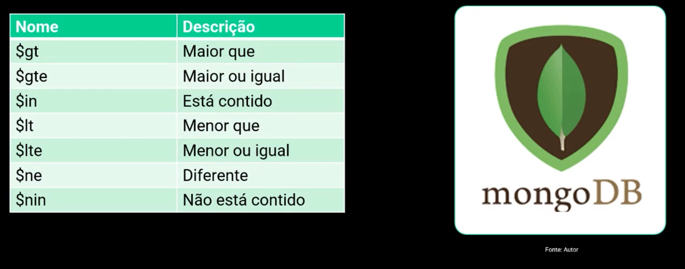

# Arquitetura e Modelagem de Dados

## Arquitetura de dados

Tem como características básicas auxiliar os tomadores de decisão na parte de seleção, distribuição, avaliação e governança de dados. Definir de forma simples a modelagem e implementação de dados.

**Objetivos**:

Descrever os métodos, técnicas e ferramentas para soluções de arquitetura de dados. 

Entre os métodos estão:

- Arquitetura em Bach (Ex: dados atualizados 1x por semana, toda sexta-feira)
- Arquitetura baseada em Streaming e ou tempo real (Ex: técnicas como ETL)

Existem várias ferramentas, como Apache Airflow, Apache Hop, Apache Kafka, Apache NIFI, Apache Sqoop, Pentaho Data Integrator..

**Componentes comuns da Arquitetura de Dados


- **Data Source Layer**: Pode ser diversas fontes de dados
- **Ingestion Layer**: em batch e/ou streaming 
- **Data Storage Layer**: armazenamento temporário, podendo ser cold ou hot
- **Processing Layer**: relacionada a processamento a nível de negócio
- **Analitycs Layer**: consome e manipula dados, análise a nivel de negócio
- **Data Vizualization Layer**: dashboards ou relatórios
- **Orquestrador**: Orquestra as camadas acima e jobs de Machine Learning

### Dados Estruturados e Não Estruturados

- Dados estruturados são aqueles organizados e representados numa estrutura rígida e não flexível. *Ex: um banco de dados relacional.*

- Dados não estruturados possuem uma estrutura dinâmica e flexível, ou até sem qualquer estrutura. *Ex: bancos não relacionais*


## Modelagem de Dados

Criar um modelo que explique as características de funcionamento e comportamento de um software. Parte importante do desenho de um sistema de informação.

Modelos (já visto na aula Essential Database):

- Conceitual;
- Lógico;
- Físico

## Armazenamento de dados

### Data Warehouse

É um sistema que armazena dados históricos usados no processo de tomada de decisão. Sua função é centralizar os dados num repositório para que usuários realizem consultas, gerem relatórios e façam análises. Orientado a assunto. Dados são relativo a um período de tempo.


### Data Mart

São mantidos no DW. São subconjuntos de dados relativos a times ou setores diferentes.

Ex: Data Mart Financeiro, Data Mart Vendas..

### Data Lake

Armazena fontes díspares de dados em seu formato nativo. São utilizados para armazenar grandes volumes de dados. Armazena dados brutos, cuja finalidade ainda não foi definida, diferentemente de um DW. Serve dados para modelos de Machine Learning.

Ex: dados capturados em IoT (Sensores, câmeras) são armazenados em um Data Lake.

### Lake House

Também conhecido como Data Lake House. Arquitetura moderna que permite armazenar, entender e analisar os dados. Combina o poder e abundância dos Data Warehouses com a amplitude e flexibilidade das tecnologias de Data Lakes.

## Modelagem de Dados

Modelagem, como visto no Módulo 02, Essencial Database, passa por definir as Entidades e os Relacionamentos, definindo os modelos **conceitual**, **lógico** e **físico**.

Esquema:

- Aluno (nome, matrícula, endereço, curso)

Instância:

- (David, 129303291, Rua Biribinha, eng-de-dados)

## NoSql

Não possuem esquema e são semistruturados ou não estruturados. Não são organizados em tabelas, mas em coleções sem uma estrutura definida, podendo incluir atributos a qualquer momento.

Não são o oposto dos bancos SQL. Na verdade, podemos usar ambos no nosso sistema com funções diferentes. A isso, chamamos de **persistência poliglota**.

Tipos:

- **Banco de dados de chave-valor**: Redis, Riak, Memcached, BerkeleyDB, LevelDB

- **Banco de dados documentos**: MongoDB, CouchDB, OrientDB, RavenDB

- **Famílias de colunas**: Amazon SimpleDB, Cassandra, Hbase, Hypertable

- **Banco de dados de Grafos**: Neo4J, OrientDB, InfiniteDB, FlockDB

Normalmente utilizamos JSON para definição dos agregados.

- Comandos:

```
show dbs;
use NOME_DO_BANCO;   // cria caso não exista
show collections;
db.albuns.insert({"nome": "David", "email": "david@uol.com.br"});
db.albuns.find({"nome": "David"})
db.albuns.findOne({"nome": "David"})
```

Alguns comparadores do MongoDB:


```
db.albuns.find({"duracao": {"$lt": 1800}})

db.albuns.find({
    $and: [
        {"dataLancamento": {"$gte": new Date(1986,0,1)}},
        {"dataLancamento": {"$lt": new Date(1987,0,1)}},
    ]
})
```

Para o **MongoDB**, temos o **Atlas MongoDB**, que é a platagorma de dados em multi-nuvem. Ele ajuda com resiliência e escalabilidade.