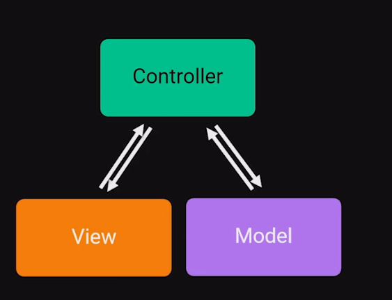
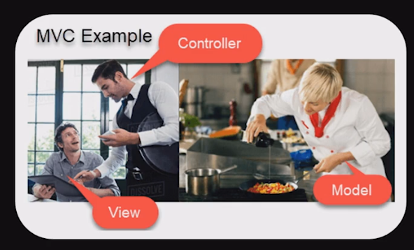

# Modelo MVC e API RESTful

Para esse módulo iremos utilizar:

- [IDE Spring Tools](https://spring.io/tools)
- [Lombok (Java library)](https://projectlombok.org)
- [Postman](https://www.postman.com/)

## MVC

É o acrônimo de _Model-View-Controller_, um padrão de projeto de software desenvolvido no final da década de 70 por Trygve Reenskaug.

Padrão arquitetural que rege toda arquitetura da aplicação. Divido em camadas com responsabilidades específicas. Separa a interface do usuáiro da lógica de negócios e também de dados, facilitando a manutenção e a escalabilidade.

Foi introduzido pela primeira vez em 1987 na linguagem de programação Smalltalk e aceito como um padrão em 1988.

O objetivo era resolver o problema de usuários controlando um conjunto de dados grande e complexo. Como foi criado antes dos navegadores Web, foi projetado inicialmente para interfaces gráficas de usuário (GUI). Atualmente é um padrão na maioria dos Frameworks de desenvolvimento.

## API RESTful

### API

_Application Programmin Interface_ é um conjunto de instruções e padrões que possam ser consumidos por sua aplicação, sem conhecer os detalhes da implementação. Permite a **comunicação entre aplicações**.

### REST

_Representational State Transfer_ é um estilo de arquitetura que consiste em princípios/regras/restrições que permitem a criação de um projeto com interfaces bem definidas. Usa HTTP para solicitar dados.

**API RESTful**: capacidade de uma API de aplicar os princípios REST.

Princípios:

- **Uniform Interface**: padrão de consumo de dados
- **Stateless**: não armazena estado
- **Cachable**: ter um cache de dados
- **Client-Server**: cliente se comunicando com servidor
- **Layered system**: pode ser usado em camadas, no meio de outros serviços e chamadas para outras aplicações
- **Code on Demand**: a interface do usuário pode mudar de acordo com o retorno da API

